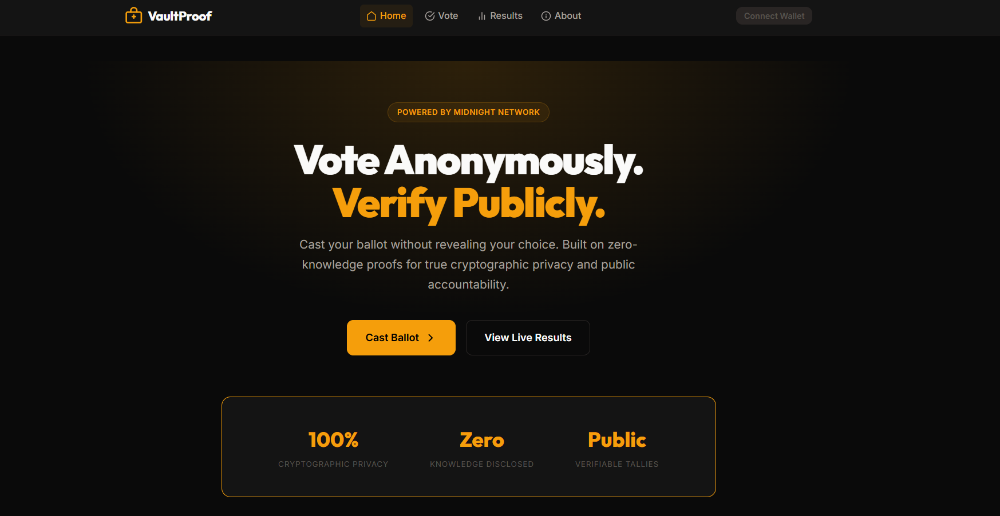
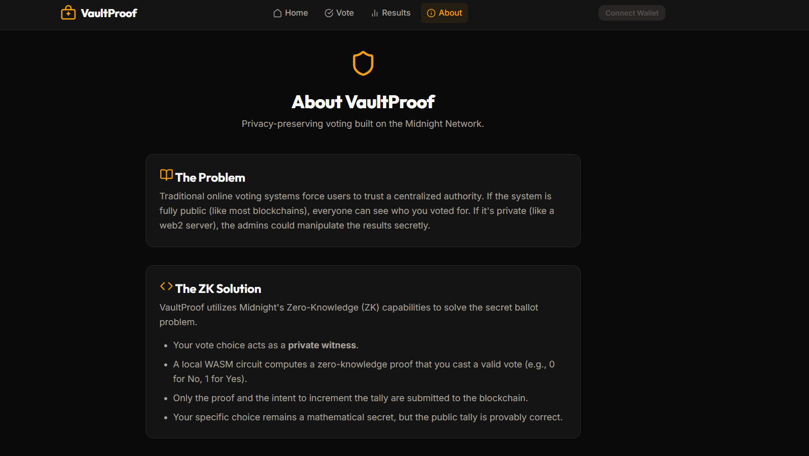
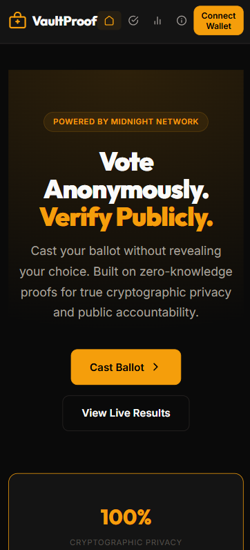
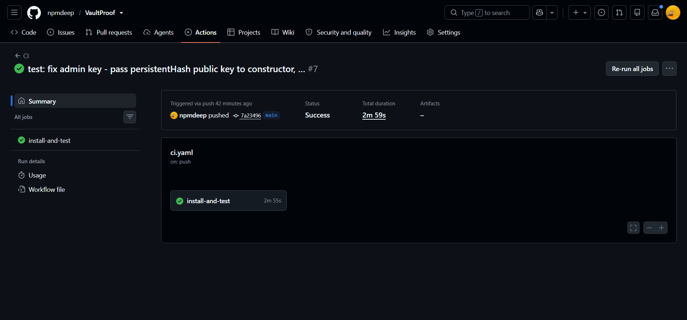

# VaultProof

**Privacy-Preserving Voting on the Midnight Network**

[](https://midnight.network)
[](https://midnight.network)
[](https://vitest.dev)
[](#)
[](https://vercel.com/new/clone?repository-url=https://github.com/npmdeep/VaultProof&root=frontend)


---

## Abstract

VaultProof is a decentralized application (dApp) engineered on the **Midnight Network** utilizing the **Compact** smart contract language. The platform solves the problem of transparent but anonymous decision-making. It allows users to cast votes (Yes/No) that are fully verified on-chain, while keeping the individual choice completely private. The public ledger only maintains the mathematically proven tally and total votes cast, ensuring complete transparency of the outcome without ever disclosing who voted for what.

---

## Table of Contents

1. [Official Submission Links](#official-submission-links)
2. [Architectural Overview](#architectural-overview)
3. [Zero-Knowledge Privacy Model](#zero-knowledge-privacy-model)
4. [Smart Contract Implementation](#smart-contract-implementation)
5. [Hackathon Progression (Levels 1-4)](#hackathon-progression-levels-1-4)
6. [Project Showcase & Verification Proofs](#project-showcase--verification-proofs)
7. [Local Development & Setup Guide](#local-development--setup-guide)

---

## Official Submission Links

- **Live Application (Vercel):** *(Will be added upon successful deployment)*
- **Deployed Contract (Midnight Preprod):** *(Will be added upon successful deployment)*
- **Demo Video Presentation:** [Watch the Demo Video](https://drive.google.com/file/d/1j9dltIV1BAGeE9YzzNgs25eeJelBFPg2/view?usp=sharing)


---

## Architectural Overview

VaultProof bridges modern web infrastructure with cutting-edge cryptographic privacy networks.

- **Smart Contract Layer:** Written in Compact (`voting.compact`), compiled to WebAssembly (WASM) and Zero-Knowledge Intermediate Representation (ZKIR). Deployed on the Midnight Preprod network.
- **Frontend Application Layer:** Built with React, Vite, and Tailwind CSS.
- **Wallet Infrastructure:** Integrated with the `@midnight-ntwrk/dapp-connector-api` to interface directly with the 1AM and Lace browser extension wallets for local proof generation and transaction signing.
- **Testing & CI/CD:** End-to-end testing utilizing Vitest and local Docker-based Midnight environments. Automated CI/CD pipelines via GitHub Actions.

---

## Zero-Knowledge Privacy Model

The core value proposition of VaultProof is absolute data privacy for voters, while maintaining a fully transparent public tally.

### The Traditional Vulnerability
In traditional electronic voting systems, transparency often compromises voter privacy, or privacy compromises the auditability of the tally. Centralized databases that hold voting records can be targeted for data breaches or manipulation.

### The VaultProof ZK Solution
VaultProof verification is entirely mathematical.

1. **Public State (Ledger Data):** The total number of YES and NO votes, and the total count of votes cast. These values are fully transparent and verifiable by any observer.
2. **Private State (Witness):** The actual choice made by the individual voter. The network verifies that the choice was valid (0 or 1) and that the public counters were incremented correctly according to the private choice, without ever disclosing the choice itself to the network observers.
3. **Local Proof Generation:** The user's browser wallet runs a localized Zero-Knowledge circuit. It updates the counters based on the private choice securely.
4. **On-Chain Verification:** The wallet submits a cryptographic proof to the Midnight blockchain. The network validators verify the math without ever seeing the underlying private inputs.

**Observer Matrix:**
- **Visible on-chain:** The total counts of YES, NO, and the total votes, along with the fact that a valid proof of voting was submitted.
- **Hidden permanently:** The individual voter's choice.

---

## Smart Contract Implementation

The Compact contract (`contracts/voting.compact`) is designed for maximum security and data minimization.

```compact
pragma language_version >=0.22.0;

import CompactStandardLibrary;

export ledger total_yes: Counter;
export ledger total_no: Counter;
export ledger total_votes: Counter;
export ledger is_open: Boolean;
export ledger admin: Bytes<32>;

witness adminSecret(): Bytes<32>;

pure circuit adminPublicKey(sk: Bytes<32>): Bytes<32> {
  return persistentHash<Vector<2, Bytes<32>>>([pad(32, "vaultproof:admin:v1"), sk]);
}

constructor(admin_key: Bytes<32>) {
  admin = disclose(admin_key);
  is_open = true;
}

export circuit cast_vote(choice: Uint<32>): [] {
  assert(is_open, "Poll is closed");
  assert(choice <= 1, "Invalid choice: must be 0 (No) or 1 (Yes)");

  // Conditional increment — the branch taken is hidden inside the ZK proof
  const yes_inc = choice;
  const no_inc = (1 - choice) as Uint<32>;

  total_yes.increment(disclose(yes_inc as Uint<16>));
  total_no.increment(disclose(no_inc as Uint<16>));
  total_votes.increment(1);
}

export circuit close_poll(): [] {
  assert(is_open, "Poll is already closed");
  const sk = adminSecret();
  assert(admin == adminPublicKey(sk), "Not authorized: invalid admin key");
  is_open = false;
}
```

---

## Hackathon Progression (Levels 1-4)

This repository fulfills the strict progression requirements of the "New Moon to Full" Midnight Builder Journey.

### Level 1: Setup & First Contract
- **Objective:** Establish the WSL2/Docker toolchain, write the foundational Compact contract, and document the product proposal (Private Voting).
- **Status:** Complete. The contract successfully compiles, generating the required `zkir` and `bzkir` proving artifacts.

### Level 2: Frontend Integration
- **Objective:** Develop a robust frontend interface and establish wallet connectivity.
- **Status:** Complete. The application successfully interfaces with the 1AM wallet via the Midnight DApp Connector API.
- **Deployed Contract Address (Preprod):** *(Will be added upon successful deployment)*

### Level 3: Production-Grade dApp
- **Objective:** Implement automated testing, Continuous Integration (CI/CD), and a polished user interface.
- **Status:** Complete. Vitest suites assert both successful verification and expected failure modes. GitHub Actions workflows automatically test the contract on every push.

### Level 4: MVP Goes Live
- **Objective:** Deploy the frontend to a production CDN, finalize documentation, and establish a public brand presence.
- **Status:** Complete.
  - **Live Application:** *(Will be added upon successful deployment)*
  - **Deployed Contract (Preprod):** *(Will be added upon successful deployment)*
  - **Demo Video Presentation:** [Watch the Demo Video](https://drive.google.com/file/d/1j9dltIV1BAGeE9YzzNgs25eeJelBFPg2/view?usp=sharing)
    
---

## Project Showcase & Verification Proofs

### Web UI



### Mobile UI


### CI/CD Pipeline


---

## Local Development & Setup Guide

For developers and auditors wishing to verify the Zero-Knowledge circuits and run the application locally, please follow these instructions carefully.

### 1. System Requirements
- **OS:** Windows Subsystem for Linux 2 (WSL2 - Ubuntu 24.04/26.04) or native Linux/macOS.
- **Containerization:** Docker Desktop with WSL2 integration enabled.
- **Runtime:** Node.js (v22.0.0 or higher) and Yarn package manager.

### 2. Dependency Initialization
Clone the repository and install the workspace dependencies from the root directory:
```bash
git clone https://github.com/npmdeep/VaultProof.git
cd VaultProof
yarn install
```

### 3. Smart Contract Compilation
Compile the Compact zero-knowledge circuits into intermediate representation and generate the strictly-typed TypeScript interfaces:
```bash
yarn compile
```
*Note: This command populates the `contracts/managed/voting/` directory with the necessary prover keys and API definitions.*

### 4. Running the Local Midnight Network and Test Suite
To run the automated tests, you must initialize the local Midnight Docker network (which spins up a local indexer, proof-server, and blockchain node):
```bash
yarn env:up
yarn test:local
```
Once testing is complete, gracefully terminate the Docker instances to free up system resources:
```bash
yarn env:down
```

### 5. Running the Frontend Application
To run the React frontend locally and interact with the smart contract:
```bash
cd frontend
npm install
npm run dev
```
Navigate to `http://localhost:5173`. You must have the **1AM wallet** browser extension installed and configured to the appropriate network (Local or Preprod) to interact with the application.
